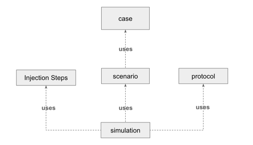

# atscale-gatling-core

Overview

Runs Gatling Tests. Project uses Maven to manage compilation, and testing.

The primary goal of this project is to fully automate the testing process by pulling queries from the AtScale database where each user query is logged.  These queries are typically generated via interactions with a BI tool which passes them to AtScale for execution.  Once we have retrieved the queries we automate running the queries before and after version upgrades to build confidence that the upgrade will go smoothly in customer environments.  This facilitates testing of the AtScale platform without having to invoke BI tooling.

This project was built using temurin-21 open jdk.  It provides Gatling tests for both the AtScale JDBC endpoint and the AtScale XMLA endpoint. 
JDBC leverages the gatling-jdbc-plugin.  XMLA is SOAP over HTTP.  HTTP requires no additional or special support as it is standard for Gatling.  For additional information on Gatling JDBC see: https://github.com/galax-io/gatling-jdbc-plugin/tree/main/src/test

Gatling generates HTML formatted reports, which can be found under: target/gatling.  In the reports, Gatling test results are categorized as OK or KO with KO being the opposite of OK meaning not OK.

It's possible to run and extend this project.  However, we believe there is an easier path.   Our intent for this project is to build a jar that gets uploaded to Maven Central.  Then to use that jar in a far simpler project.  Refer to the https://github.com/AtScaleInc/atscale-gatling project for a much easier way to run Gatling tests against AtScale.

Prerequisites should you choose to run this project:

Add a properties file named system.properties to the src/main/resources directory modeled like the example_system.properties file in the same directory.  

This file should contain the following properties:
1. A list of models
2. The JDBC URL to connect to the Atscale Postgres Database where system configuration data and query data is stored.  The database is named atscale.
3. The username and password to connect to the Atscale Postgres Database
4. A set of properties to connect to the AtScale JDBC endpoint for each model.  AtScale emulates Postgres so the JDBC URL looks similar to the AtScale database where system configuration is stored.
5. A set of properties to connect to the AtScale XMLA endpoint for each model.

```
atscale.models=model1,model2,model3
atscale.jdbc.url=jdbc:postgresql://your_host:your_port/atscale
atscale.jdbc.username=your_username
atscale.jdbc.password=your_password
atscale.model1.jdbc.url=jdbc:postgresql://your_host:your_port/your_catalog
atscale.model1.jdbc.username=your_keycloak_username
atscale.model1.jdbc.password=your_keycloak_password
atscale.model1.jdbc.maxPoolSize=10
atscale.model2.jdbc.url=jdbc:postgresql://your_host:your_port/your_catalog
atscale.model2.jdbc.username=your_keycloak_username
atscale.model2.jdbc.password=your_keycloak_password
atscale.model2.jdbc.maxPoolSize=10
atscale.model3.jdbc.url=jdbc:postgresql://your_host:your_port/your_catalog
atscale.model3.jdbc.username=your_keycloak_username
atscale.model3.jdbc.password=yuor_keycloak_password
atscale.model3.jdbc.maxPoolSize=10
atscale.model1.xmla.url=your_atscale_xmla_url_with_access_token
atscale.model1.xmla.cube=cube_name_for_model1
atscale.model1.xmla.catalog=catalog_name_for_model1
```  

Run this command to extract queries from the Atscale database into a files:
```shell
 ./mvnw clean install exec:java -Dexec.mainClass="com.atscale.java.executors.QueryExtractExecutor"
```
There is also a maven goal defined in the pom.xml file.  The same command can be run using:
```shell
 ./mvnw clean install exec:java@query-extract
```
where query-extract is the id of the execution to be run.

For details refer to the pom.xml file and look for:  <artifactId>exec-maven-plugin</artifactId>

If run successfully, there will be two files created in the directory /queries for each model defined in the atscale.models property

Once we have extracted the queries we can run Gatling Scenario Simulations to execute the queries against the Atscale Engine.

The easiest way to run Gatling Simulations is to create an Executor under src/main/com/atscale/java/executors.  The project includes open and closed step executors.  These classes run Gatling Simulations using open steps or closed steps.  Simulations can be run using one of the following commands:
```shell
 ./mvnw clean install exec:java@open-step-simulation-executor 
````
```shell
 ./mvnw clean install exec:java@closed-step-simulation-executor 
````
or
```shell
 ./mvnw clean install exec:java -Dexec.mainClass="com.atscale.java.executors.OpenStepSimulationExecutor"
```

Examples include ClosedStepSimulationExecutor and OpenStepSimulationExecutor.  These executors run Gatling simulations that use closed steps and open steps respectively.  The executors can be found under src/main/com/atscale/java/executors.  These are examples only.  They will have to be tailored to the models and data in your environment.

Can clean, build and run an individual test as follows
Java:
```shell
 ./mvnw clean install & ./mvnw gatling:test -Dgatling.simulationClass=com.atscale.java.jdbc.simulations.AtScaleOpenInjectionStepSimulation  -Dgatling.runDescription="Internet Sales Model Test" -Datscale.model="internet_sales"
```
Scala:
```shell
 ./mvnw clean install & ./mvnw gatling:test -Dgatling.simulationClass=com.atscale.scala.jdbc.simulations.JdbcSingleUserSimulation  -Dgatling.runDescription="Internet Sales Model Tests" -Datscale.model="internet_sales"
```


Gatling provides extensive capabilities to shape our tests.  For instance, we can simulate various numbers of concurrent users ramping up load and ramping down load over time.  These capabilities are defined as InjectionSteps within Gatling Simulation classes. This utility has abstracted those behaviors such that we can pass a list of InjectionSteps to our desired simulation. Accordingly, users can shape their tests without writing custom Gatling simulations. Injection steps implement the adaptor design pattern to produce a standard Gatling open or closed injection step that is used in the simulation.  To better understand these injection steps refer to the Gatling documentation.  See: https://docs.gatling.io/tutorials/scripting-intro/    

Defining open and closed injection steps in the same list is not supported.

Passing Open Injection Steps to a Closed Injection Step Simulation is not supported.

Passing Closed Injection Steps to an Open Injection Step Simulation is not supported.

A few words on Gatling.  In a typical Gatling simulation, we begin with a set of test cases.  One more more cases are defined in a scenario.  A simulation combines a scenario, a protocol such as HTTP or JDBC and one or more injection steps to simulate some type of load over time on our system under test.



In this project each case is a query that is run against the AtScale Engine's JDBC or XMLA endpoint.  We have abstracted the test cases by generating queries to run -- queries are extracted from the underlying Postgres database that sits behind the AtScale Engine.  We have abstracted the scenarios by creating a standard scenario to run all queries for a given model.  We have abstracted the protocols by providing both JDBC and HTTP (XMLA) protocols. We have abstracted the simulations into 4 patterns which provide OpenStepSimulations or ClosedStepSimulations for JDBC or for XMLA.  Finally we abstracted the injection steps by providing an adaptor design pattern to create open or closed injection steps.  This allows users to shape their tests without having to write custom Gatling simulations.